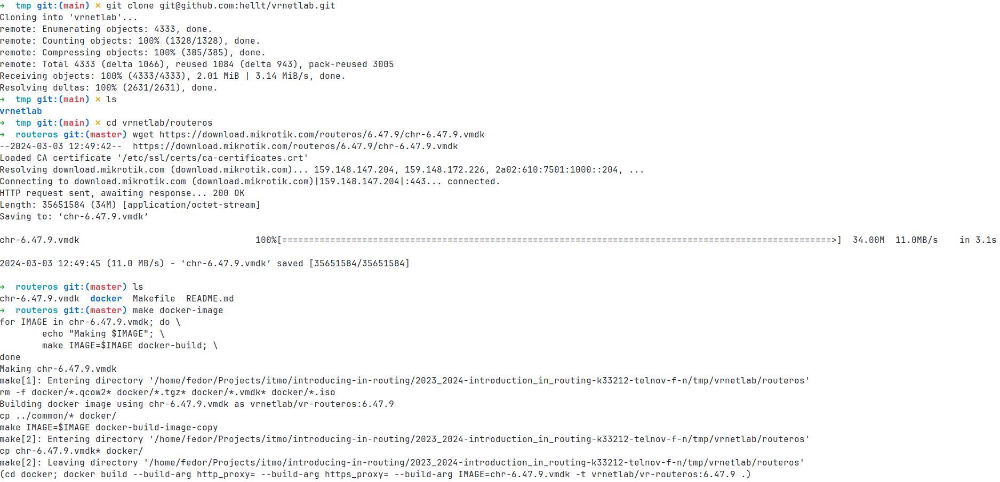
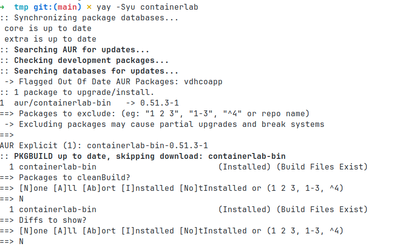
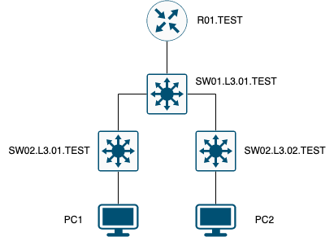
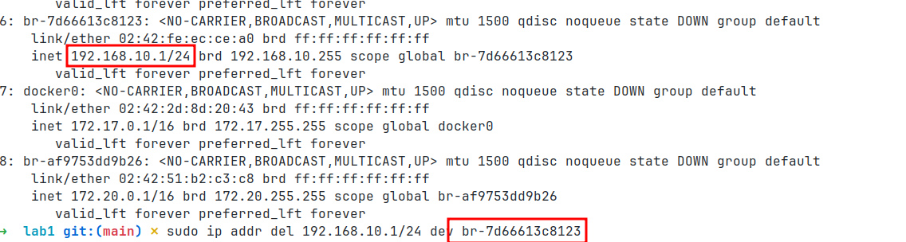
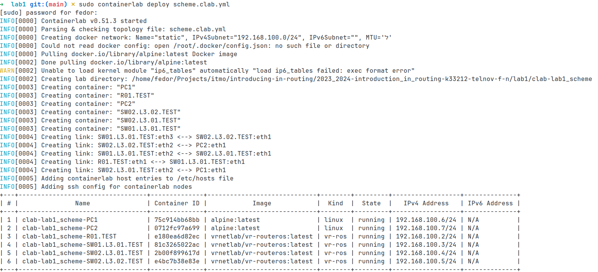
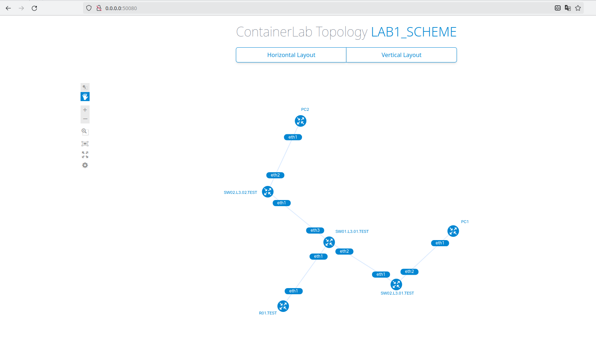
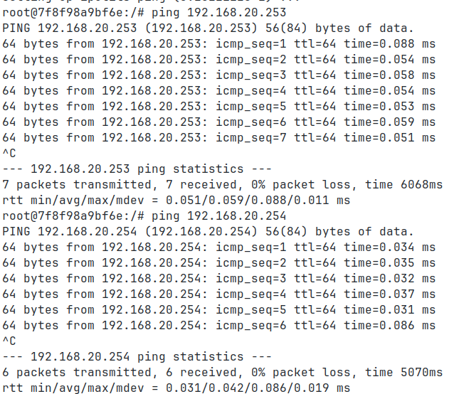

## Отчёт о Лабораторной работе №1  "Установка ContainerLab и развертывание тестовой сети связи"

### Информация об отчёте

**_Учебное заведение_**: Университет ИТМО  
**_Факультет_**: Инфокоммуникационные технологии  
**_Образовательная программа_**: Инфокоммуникационные технологии и системы связи  
**_Учебная группа_**: K33212  
**_Отчёт подготовил_**: Тельнов Федор Николаевич  
**_Дата_**: 22.02.2023

### Описание работы

В данной лабораторной работе вы познакомитесь с инструментом ContainerLab, развернете тестовую сеть связи, настроите оборудование на базе Linux и RouterOS.

### Цель работы

Ознакомиться с инструментом ContainerLab и методами работы с ним, изучить работу VLAN, IP адресации и т.д.

### Ход работы

1. Перед началом выполнения лабораторной работы были выполнены следующие подготовительные действия:

   1. Клонирование репозитория hellt/vrnetlab
   2. В папку hellt/vrnetlab/routeros загружен файл `chr-6.47.9.vmdk`, образ собран с помощью make docker-image.
      
   3. Наконец, был установлен `ContainerLab`, используя репозиторий пакетов AUR: `yay -Syu containerlab`
      

2. Создается трехуровненая сеть связи классического предприятия, соответствующая данному в задании.

   

   Ее первичная настройка описывается в конфигурационном [файле](lab1/schema.clab.yml) для деплоя через `containerlab`.
   Далее сеть собирается и деплоится с помощью команды `sudo containerlab deploy schema.clab.yaml`.
   При первом запуске произошла ошибка с отсутствием нужного kernel-модуля, что в свою очередь было вызвано обновлением системы в сессии.
   Тут возникает следующая проблема `containerlab` как системы - она не содержит достаточного `graceful`-выключения,
   в результате добавленные в систему маршруты никогда не будут автоматически удалены.
   В свою очередь это привело к полной недееспособности сетевой части системы, поскольку маршруты `containerlab` пересеклись с основными маршрутами.
   После очистки ненужных маршрутов и перезагрузки системы, вышеуказанная команда выполняется успешно. Скрины удаления маршрутов и запуска приложены ниже.
   
   

   Проверку графа можно осуществить с помощью команды `sudo containerlab graph`. Ее результат показан на следующем скриншоте.
   

3. Далее была проведена настройка IP-адресов и VLAN-ов, создание DHCP, устройствам выданы имена.

   1. Настройка Роутера R01.TEST
      1. /interface vlan  
         Создано два виртуальных интерфейса (VLAN) на интерфейсе ether2:  
         vlan10 с идентификатором VLAN 10.  
         vlan20 с идентификатором VLAN 20.
      2. /ip pool  
         Создано два IP-пула для выдачи адресов клиентам:  
         pool10 с диапазоном адресов от 192.168.10.10 до 192.168.10.254 для VLAN 10.  
         pool20 с диапазоном адресов от 192.168.20.10 до 192.168.20.254 для VLAN 20.
      3. /ip dhcp-server  
         Создано два DHCP-сервера, каждый из которых обслуживает соответствующий VLAN:  
         server1 для VLAN 10 с использованием IP-пула pool10.  
         server2 для VLAN 20 с использованием IP-пула pool20.  
         4./ip address  
         Назначены IP-адреса интерфейсам:  
         IP-адрес 172.16.228.138/30 для интерфейса ether1.  
         IP-адрес 192.168.10.1/24 для интерфейса vlan10.  
         IP-адрес 192.168.20.1/24 для интерфейса vlan20.
      4. /ip dhcp-client  
         Включен DHCP-клиент на интерфейсе ether1.
      5. /ip dhcp-server network  
         Устанавлены адреса сетей и шлюзы для DHCP-серверов:  
         Для server1 (VLAN 10) сеть 192.168.10.0/24 и шлюз 192.168.10.1.  
         Для server2 (VLAN 20) сеть 192.168.20.0/24 и шлюз 192.168.20.1.
      6. /system identity  
         Устанавлено имя устройства R01.TEST.
   2. Настройка Маршрутизатора SW01.L3.01.TEST
      1. /interface bridge  
         Создано три моста (bridge) с именами bridge, bridge10 и bridge20.  
         Мосты используются для объединения интерфейсов VLAN на устройстве.
      1. /interface vlan  
         Создано четыре виртуальных интерфейса VLAN, каждый из которых связан с интерфейсом ether2:
         1. vlan10 с идентификатором VLAN 10.
         1. vlan20 с идентификатором VLAN 20.
         1. vlan30 с идентификатором VLAN 10.
         1. vlan40 с идентификатором VLAN 20.
      1. /interface bridge port  
         Привязаны интерфейсы VLAN к соответствующим мостам:
         1. vlan10 и vlan30 привязаны к bridge10.
         1. vlan20 и vlan40 привязаны к bridge20.
      1. /ip address  
         Назначен IP-адрес интерфейсу ether1 с адресом 172.16.228.138/30 и сетью 172.16.228.136.
      1. /ip dhcp-client  
         Включены DHCP-клиенты на интерфейсах ether1, bridge10 и bridge20./system identity  
         Устанавлено имя устройства SW01.L3.01.TEST.
   3. Настройка Маршрутизатора SW02.L3.01.TEST  
      Использованы команды, аналогичные настройке SW01.L3.01.TEST
   4. Настройка Маршрутизатора SW02.L3.02.TEST  
      Использованы команды, аналогичные SW01.L3.01.TEST

4. Для проверки доступности используется команда `ping`, результаты их показаны на скриншотах ниже.
   
