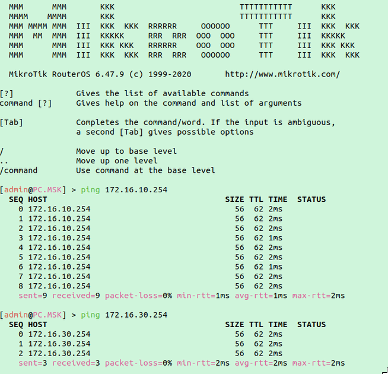
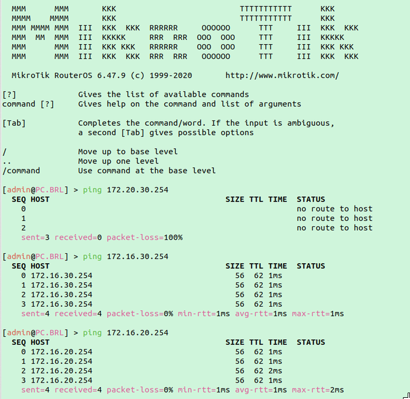

## Отчёт о Лабораторной работе №2 "Эмуляция распределенной корпоративной сети связи, настройка статической маршрутизации между филиалами"

### Информация об отчёте

**_Учебное заведение_**: Университет ИТМО  
**_Факультет_**: Инфокоммуникационные технологии  
**_Образовательная программа_**: Инфокоммуникационные технологии и системы связи  
**_Учебная группа_**: K33212  
**_Отчёт подготовил_**: Тельнов Федор Николаевич  
**_Дата_**: 22.02.2023

### Описание работы

В данной лабораторной работе вы первый раз познакомитесь с компанией "RogaIKopita Games" LLC которая занимается разработкой мобильных игр с офисами в Москве, Франкфурте и Берлине. Для обеспечения работы своих офисов "RogaIKopita Games" вам как сетевому инженеру необходимо установить 3 роутера, назначить на них IP адресацию и поднять статическую маршрутизацию. В результате работы сотрудник из Москвы должен иметь возможность обмениваться данными с сотрудником из Франкфурта или Берлина и наоборот.

### Цель работы

Ознакомиться с принципами планирования IP адресов, настройке статической маршрутизации и сетевыми функциями устройств.

### Ход работы

#### 1. Построение схема

Была создана схема сети, сохраненная в [файле схемы](scheme.clab.yml).
После была проверена ее корректность путем демонстрации с помощью команды `containerlab`. Демонстрация находится на скриншоте ниже.

#### 2. Настройка роутеров

Далее была проведена индивидуальная настройка роутеров

1. Роутер Франкфурта

2. Роутер Москвы

3. Роутер Берлина

#### 3. Настройка компьютеров

Далее была проведена индивидуальная настройка компьютеров

1. Компьютер Франкфурта

1. Компьютер Москвы

1. Компьютер Берлина

1.  Проверка доступности

    1.  FRT -> MSK, FRT -> BRL

        

    2.  MSK -> BRL, MSK -> FRT

        

    3.  BRL -> MSK, BRL -> FRT

        
