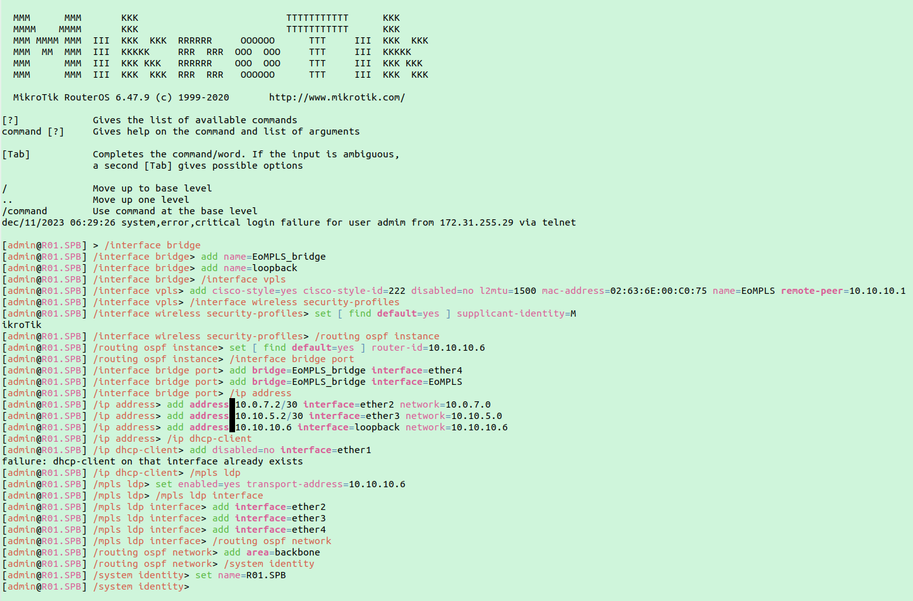

## Отчёт о Лабораторной работе №3 "Эмуляция распределенной корпоративной сети связи, настройка OSPF и MPLS, организация первого EoMPLS"

### Информация об отчёте

**_Учебное заведение_**: Университет ИТМО  
**_Факультет_**: Инфокоммуникационные технологии  
**_Образовательная программа_**: Инфокоммуникационные технологии и системы связи  
**_Учебная группа_**: K33212  
**_Отчёт подготовил_**: Тельнов Федор Николаевич  
**_Дата_**: 22.02.2023

### Описание работы

Наша компания "RogaIKopita Games" с прошлой лабораторной работы выросла до серьезного игрового концерна, ещё немного и они выпустят свой ответ Genshin Impact - Allmoney Impact. И вот для этой задачи они купили небольшую, но очень старую студию "Old Games" из Нью Йорка, при поглощении выяснилось что у этой студии много наработок в области компьютерной графики и совет директоров "RogaIKopita Games" решил взять эти наработки на вооружение. К сожалению исходники лежат на сервере "SGI Prism", в Нью-Йоркском офисе никто им пользоваться не умеет, а из-за короновируса сотрудники офиса из Санкт-Петерубурга не могут добраться в Нью-Йорк, чтобы забрать данные из "SGI Prism". Ваша задача подключить Нью-Йоркский офис к общей IP/MPLS сети и организовать EoMPLS между "SGI Prism" и компьютером инженеров в Санк-Петербурге.

### Цель работы

Изучить протоколы OSPF и MPLS, механизмы организации EoMPLS.

### Ход работы

#### 1. Схема связи

Была построена схема связи, результат деплоя:

Графовое представление сети:

#### 2. Теоретическая часть

**OSPF** - OSPF(Open Shortest Path First) является внутренним протоколом шлюзовых маршрутизаторов (IGP), который позволяет маршрутизаторам обмениваться информацией о состоянии сети и находить оптимальные пути к целевым узлам.

Протокол OSPF работает на основе алгоритма Дейкстры, который используется для определения кратчайшего пути. OSPF использует информацию о топологии сети и статусе интерфейсов для строительства базы данных маршрутизации. Маршрутизаторы, используя эту информацию, обновляют свои таблицы маршрутизации и определяют оптимальные пути до целевых узлов.

Преимущества OSPF лежат в его способности обеспечивать маршрутизацию на основе нескольких метрик, таких как пропускная способность и задержка. OSPF также обладает возможностью работать с множеством путей для достижения надежности и балансировки нагрузки. Протокол OSPF также обеспечивает быстрое восстановление связности в случае сбоев или изменений в сети.

**MPLS** - MPLS(Multi-Protocol Label Switching) был разработан для повышения производительности и эффективности работы сетей путем упрощения и ускорения маршрутизации трафика.

Одним из главных преимуществ MPLS является его способность устанавливать "метки" на пакеты данных и использовать эти метки для быстрого и оптимального перенаправления трафика внутри сети. Метка может быть присвоена пакету еще до его отправки и передается всем устройствам, через которые проходит пакет в течение его пути. Это позволяет устройствам в сети принимать решение о перенаправлении трафика на основе содержащейся в метке информации без необходимости анализировать заголовки пакетов.

MPLS также обладает способностью обеспечивать обслуживание с разными требованиями к пропускной способности и задержкам, благодаря использованию классов обслуживания (CoS). Это позволяет нам дифференцировать трафик в сети и гарантировать качество обслуживания для приоритетных приложений.

**EoMPLS** - (Ethernet over MPLS) - EoMPLS представляет собой метод передачи Ethernet-фреймов через MPLS-сеть, позволяя нам объединить преимущества обоих протоколов.

Одним из основных преимуществ EoMPLS является его способность создания виртуальных частных сетей (VPN) на основе MPLS. EoMPLS позволяет передавать Ethernet-фреймы между удаленными локациями через MPLS-туннели, что обеспечивает безопасность и изоляцию для различных клиентских сетей, работающих внутри условной VPN.

EoMPLS также обладает гибкостью и масштабируемостью, позволяя повысить эффективность использования сетевых ресурсов и удовлетворить требования различных клиентов. Эта технология подходит для развертывания географически распределенных сетей, а также для объединения физически разделенных сегментов в единую виртуальную сеть.

#### 3. Настройка устройств

##### R01.SPB

##### R01.MSK

##### R01.HKI

##### R01.LBN

##### R01.LND

##### R01.NY

##### PC1

##### SGI_Prism

#### 4. Проверка сети

##### 1. PC1 -> SGI_Prism

##### 2. Трассировка R01.SPB -> R01.NY

##### 3. MPLS конфиг

#### 4. Выводы

В ходе выполнения данной лабораторной работы на практике была изучена работа с протоколами OSPF, MPLS, EoMPLS и механизмами их организации и конфигурации.
