## Отчет по Лабораторной работе №4   "Эмуляция распределенной корпоративной сети связи, настройка iBGP, организация L3VPN, VPLS"

### Информация об отчёте

**_Учебное заведение_**: Университет ИТМО  
**_Факультет_**: Инфокоммуникационные технологии  
**_Образовательная программа_**: Инфокоммуникационные технологии и системы связи  
**_Учебная группа_**: K33212  
**_Отчёт подготовил_**: Тельнов Федор Николаевич  
**_Дата_**: 22.02.2023

### Описание работы

Компания "RogaIKopita Games" выпустила игру "Allmoney Impact", нагрузка на арендные сервера возрасли и вам поставлена задача стать LIR и организовать свою AS чтобы перенести все сервера игры на свою инфраструктуру. После организации вашей AS коллеги из отдела DEVOPS попросили вас сделать L3VPN между 3 офисами для служебных нужд. (Рисунок 1) Данный L3VPN проработал пару недель и коллеги из отдела DEVOPS попросили вас сделать VPLS для служебных нужд.

### Цель работы

Изучить протоколы BGP, MPLS и правила организации L3VPN и VPLS.

### Ход работы

#### 1. Схема связи

Была собрана схема, находящаяся в [конфигурационном файле](schema.clab.yml). Она была задеплоена с помощью `containerlab`. Результат деплоя и схема показаны на рисунках ниже.

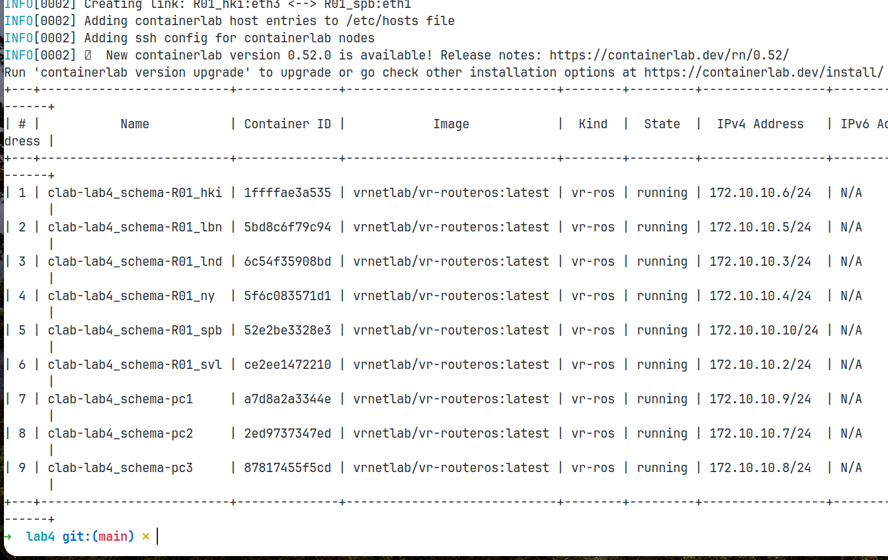

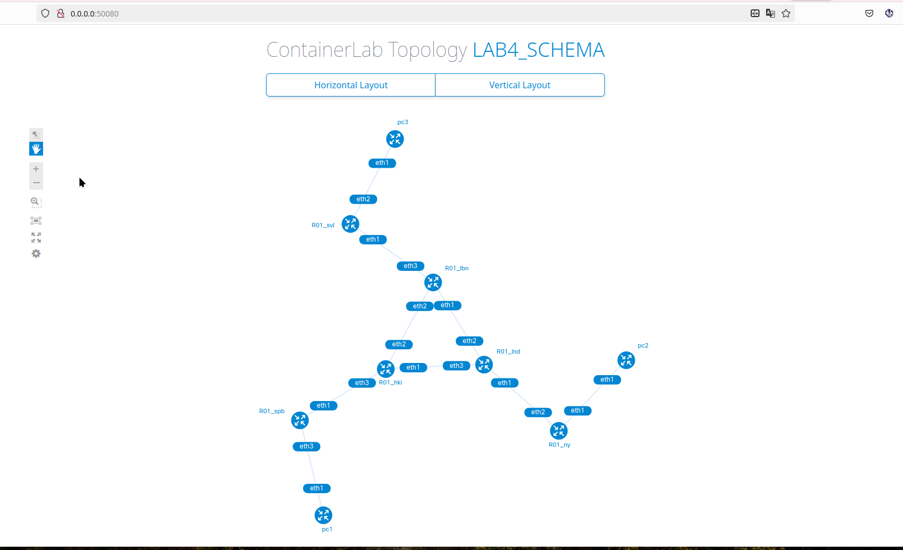

#### 2. VRF: Настройка устройств

Для начала инициализируется связь между устройствами. Также на всех устройствах создается мост Loopback с уникальными ip. На примере роутеров HKI и SPB показана конфигурация:

- SPB

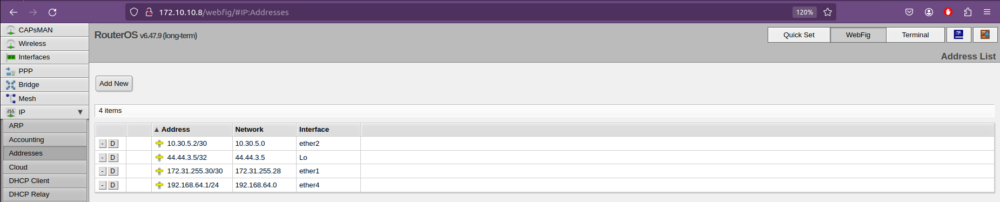

#### 3. Инициализация VRF

На всех устройствах, связанных с ПК, был создан VRF.

- NY

- SVL

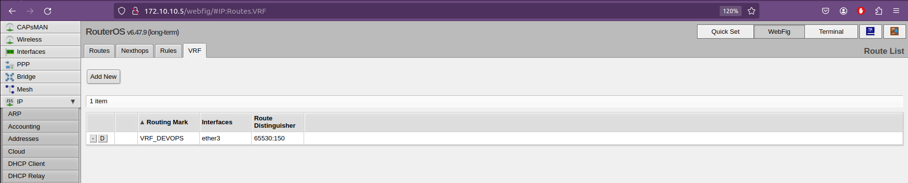

- SPB

Для каждого из этих роутеров создалась новая таблица маршрутизации.

#### 4. OSPF

На примере роутера NY настраивается OSPF.

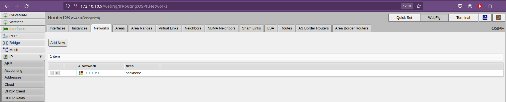

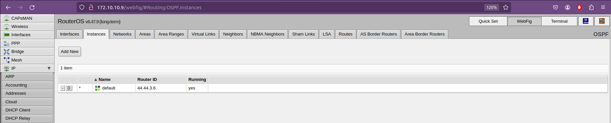

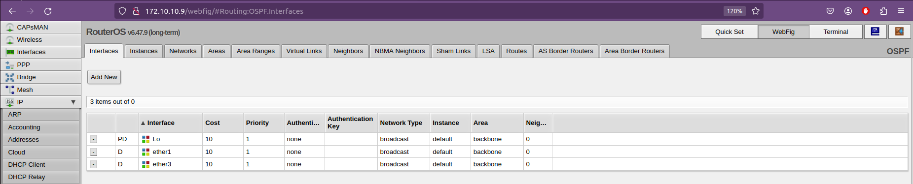

Видно, что OSPF протокол не затрагивает ранее сконфигурированный VRF.

#### 5. BGP

Аналогично на примере роутера NY настраивается iBGP

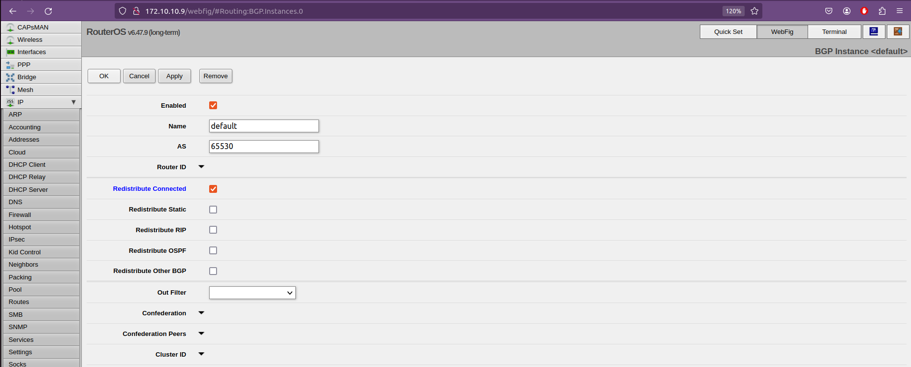

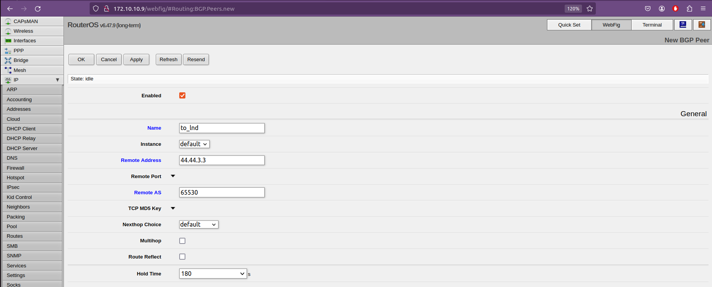

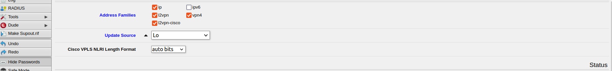

Router reflect настраивается на роутерах LND и HKI

После аналогичной настройки на лондонском роутере наблюдается установленное соединение.

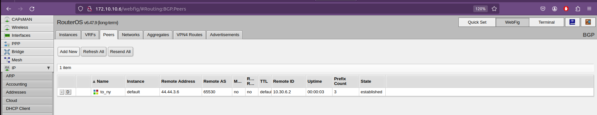

Точно также настраиваются остальные связи между роутерами. Для каждого роутера появятся соответствующие настройки.

#### 6. HKI

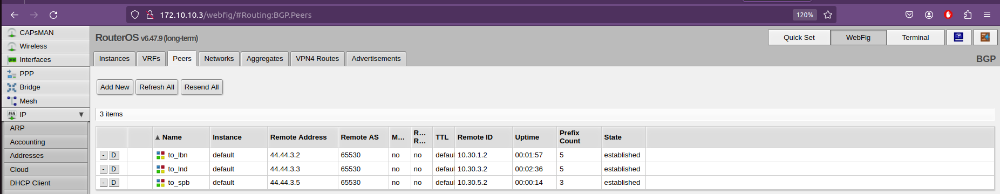

После настраивается vrf на bgp для устройств, соединенных с пк.

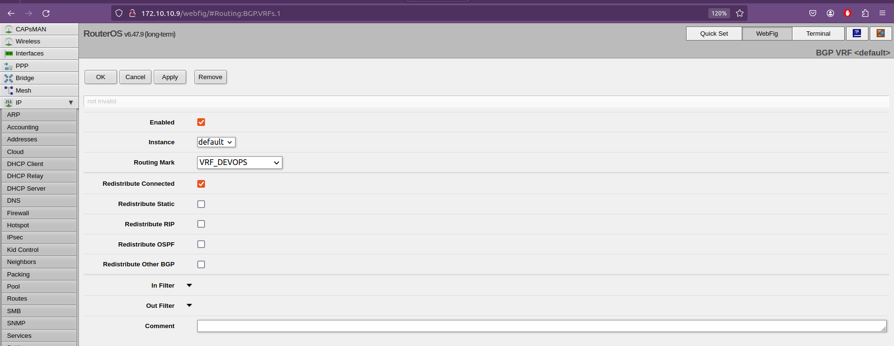

#### 7. MPLS

Для каждого роутера настраивается MPLS. Пример для роутера NY ниже.

- NY

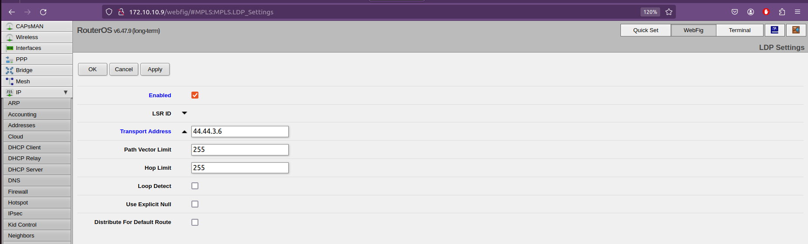

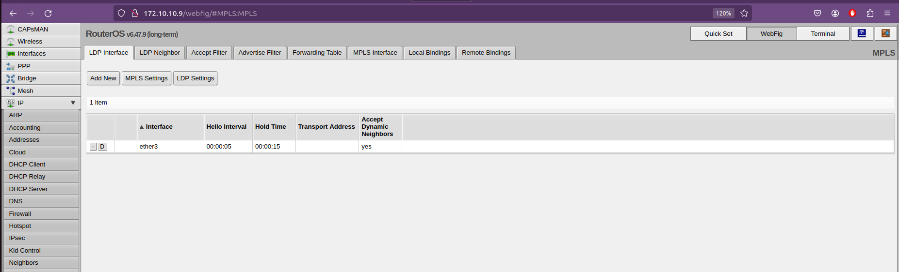

После настройки всех роутеров и их интерфейсов:

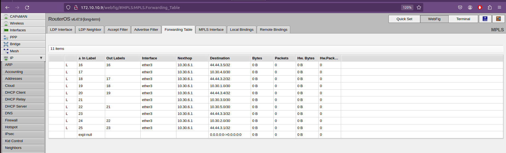

После настройки router reflect (BGP) обновится таблица VRF

- NY

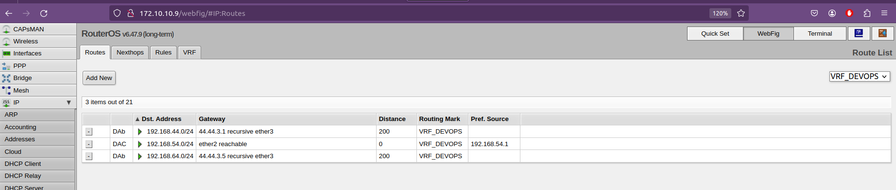

- SVL

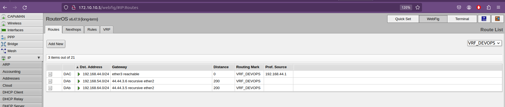

- SPB

8. VPLS. Настройка мостов

Разбирается таблица VRF и настраивается VPLS.

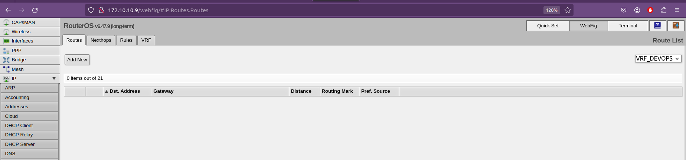

Для соответственного удаленного устройства создается интерфейс vpls

- NY

Создается мост VPLS

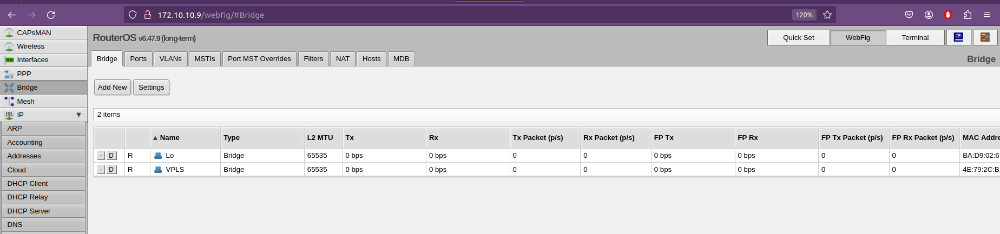

И два интерфейса для удаленных устройств.

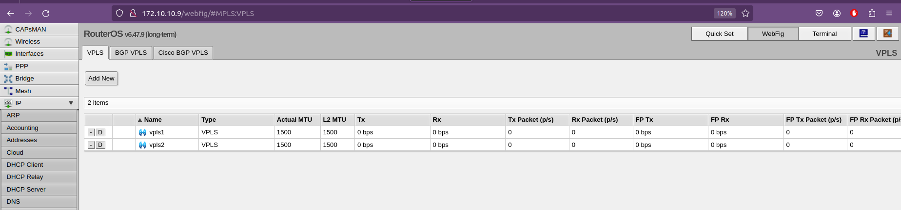

Далее связываются на других устройствах

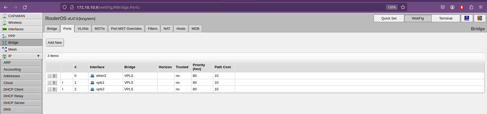

#### 8. Проверка

- PC2 - PC3; PC2 - PC1

- Для NY

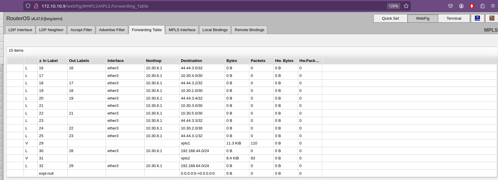

- PC1 - PC2; PC1 - PC3

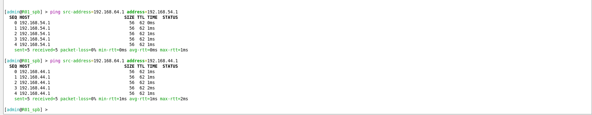

**7. Выводы**

В ходе выполнения данной лабораторной работы на практике изучены эмуляция распределенной корпоративной сети связи, настройка iBGP, организация L3VPN, VPLS
